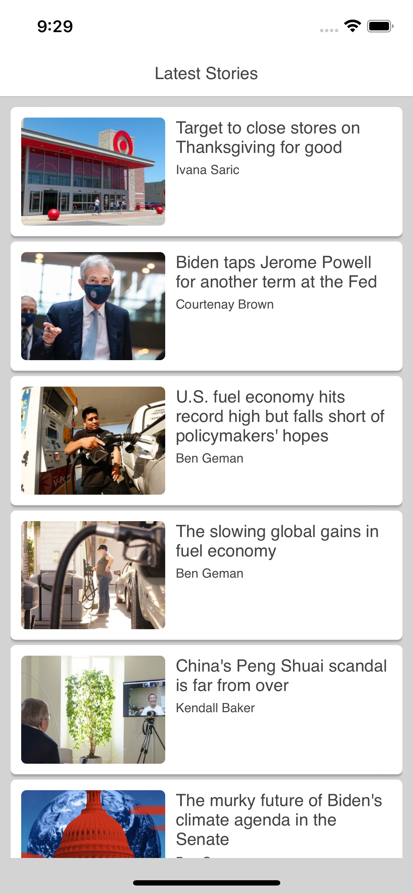

# Project Overview

This is a react native project that consumes the Axios stream and content APIs to show the user a list of the latest stories along with a detail view for each story.

  
   
   

## State Management

I used `mobx` and `mobx-react-lite` for state management in this project. I maintain a store of "Stories" that can be observed by UI components. See `StoryStore.ts` and `Store.ts` for more details.

## UI

* `styled-components`
    * I used styled components to create a small project specific component library that I used throughout the app. See `components.ts` for more details.
* `react-navigation`
    * I used react-navigation for handling navigating between the `StoryList` and `StoryDetail` screens. 
* `react-native-vector-icons`
    * I used this package to get the icons for the header button and the "Visit Axios.com" button on the StoryDetail

## Accessibility

This app should be accessible via voiceover/talkback. I enhanced the default accessibility of the app in the following ways:

* Added `header` roles to the nav headers and headline within `StoryDetail`
* Customized the `accessibility-label` of `StoryListIem` components to tell the user where they are within the list, and rephrased the text that is read relating to the heading and author
  * e.g. `5 of 20: Target to close stores on Thanksgiving for good by Ivana Saric`
* Added `image` role and `accessibility-label` to the image shown in the `StoryDetail`
* Added `button` role and `accessibility-label` to the back icon on `StoryDetail`. This tells the user that this element is clickable and will return them to the story list.

## Additional Features

* **Pull to Refresh**
    * The `StoryList` screen has pull to refresh enabled. Pulling down from the top of screen will refresh the list of stories.
* **Error Handling**
    * The `StoryList` gracefully handles connection errors, alerts the user to the error, and allows the user to retry the request
* **Partial Rich Text Support**
    * Text blocks within the story detail will display as unordered list items if appropriate

## `@TODO`
* Support `entityRanges` and `inlineStyleRanges`
    * I want to enhance the `BlockText` component to at least support the `BOLD` inline style and `LINK` entities.
* Support theming
    * `styled-components` supports themeing, so I want to refactor all my styling stuff into themes which shouldn't be much more work.
* Persistence
  * Right now, there's no persistence on my `mobx` store so the stories have to be loaded fresh on each cold start. Ideally, the old stories would stick around as a fallback in case the user doesn't have network access.
* Pull to refresh on `StoryDetail`

